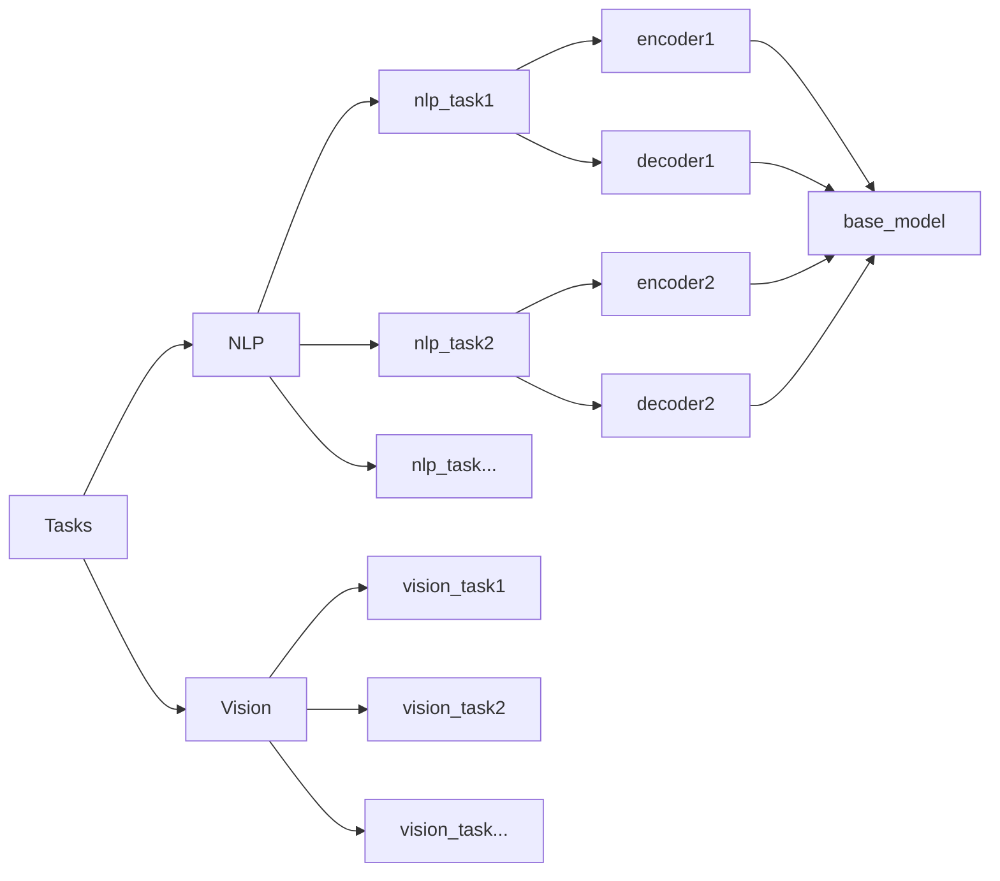

# perceival
perceiver based AGI framework

```mermaid
graph LR;
    Tasks-->NLP;
    NLP-->nlp_task1;
    NLP-->nlp_task2;
    NLP-->nlp_task...;
    Tasks-->Vision;
    Vision-->vision_task1;
    Vision-->vision_task2;
    Vision-->vision_task...;
    nlp_task1-->encoder1
    nlp_task1-->decoder1
    encoder1-->base_model
    decoder1-->base_model
    nlp_task2-->encoder2
    nlp_task2-->decoder2
    encoder2-->base_model
    decoder2-->base_model
    
```
